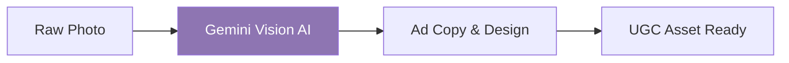
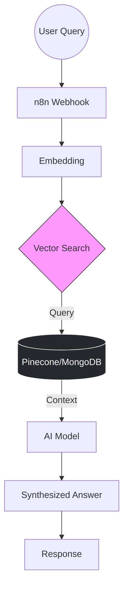

  

# Hi, I'm Uba Chan 👋

### AI Automation Expert | Vibe Coder | SaaS Builder

Helping businesses scale through intelligent workflows, custom AI agents, and seamless integrations. I specialize in turning complex manual processes into efficient, automated systems.

---

### 🚀 Quick Stats & Focus

- 🔭 **I’m currently working on:** [UreatorFlow](https://ureatorflow.pages.dev/) (AI operating studio for solo creators) and [NBGC](https://nbgc.pages.dev/) (Photos to UGC ads).
- 🌱 **I’m currently learning:** Advanced Multi-Agent Orchestration and scaling SaaS with **Lovable** & **n8n**.
- 👯 **I’m looking to collaborate on:** Open-source AI automation workflows and innovative SaaS projects.
- 💬 **Ask me about:** **n8n** automation, AI Agents, **Supabase** integration, and building a SaaS portfolio.
- 📫 **How to reach me:** https://www.linkedin.com/in/uba-chan or ubachan2025@gmail.com
- ⚡ **Fun fact:** I don't just write code! I code the vibe. ✨

---
### 🛠️ My Tech Stack

| Category | Tools & Technologies |
| :--- | :--- |
| **Automation & No-Code** |     |
| **AI & LLM Models** |         |
| **AI Dev & Databases** |      |
| **Web Dev & Frameworks** |     |
| **Editors & OS Tools** |     |
| **Specialized Tools** |  |

---

## 🌟 Featured AI Automation Projects

### 🤖 1. UreatorFlow - AI Operating Studio
*An AI-powered operating studio designed specifically for solo creators to automate their content ecosystem.*
- **Core Tech:**   
- **Key Features:** Automates content planning, scheduling, and distribution workflows.
- **Status:** [Live Demo](https://ureatorflow.pages.dev/)

---
### 📸 2. NBGC - Next-Gen Content (Photos to UGC Ads)
*A high-efficiency automation pipeline that transforms raw product photos into high-converting UGC ads using AI.*

- **Core Tech:**   

- **Impact:** Automated asset creation for marketing agencies.

- **Status:** [Live Demo](https://nbgc.pages.dev/) 

---
### 🧠 3. Agentic RAG Workflow - Intelligent Knowledge Base
*An advanced AI Agent system that understands user intent and retrieves contextually relevant information from custom databases using Vector Search.*

- **Core Tech:**     

- **Key Features:** Intent recognition, dynamic context retrieval, and low-latency AI responses.

- **Use Case:** Custom AI chatbots for businesses that need to talk to their own data.

---

### 📊 GitHub Stats

  
  

### 🤝 Connect with Me

